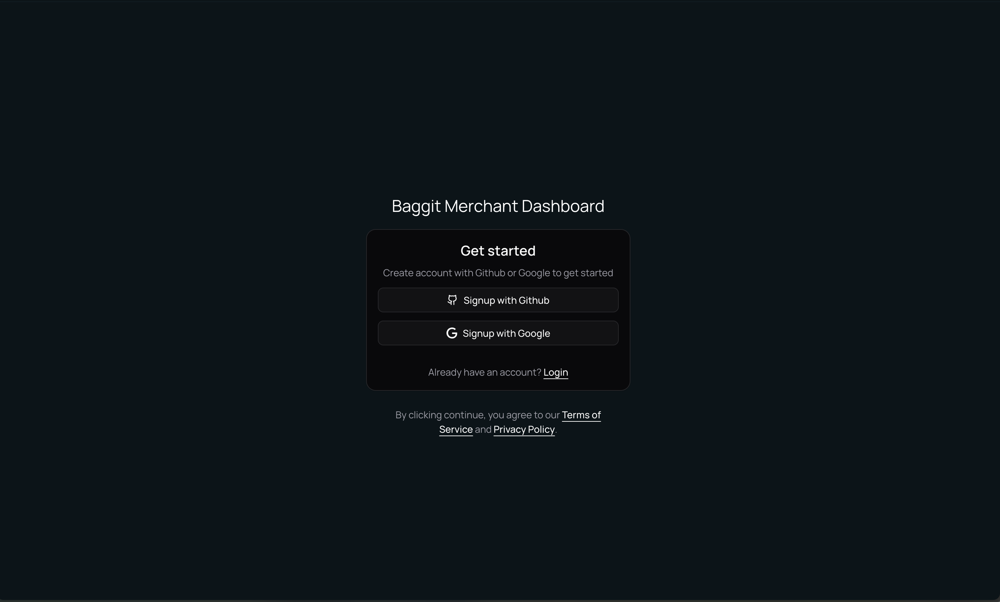
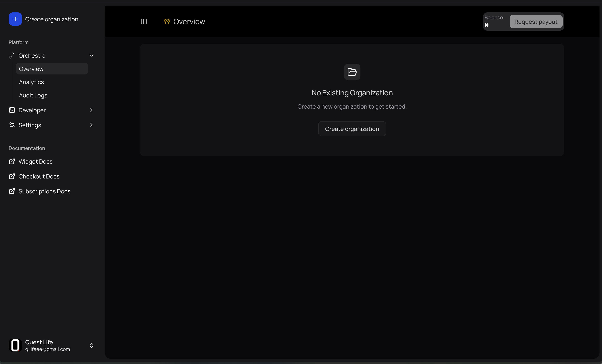
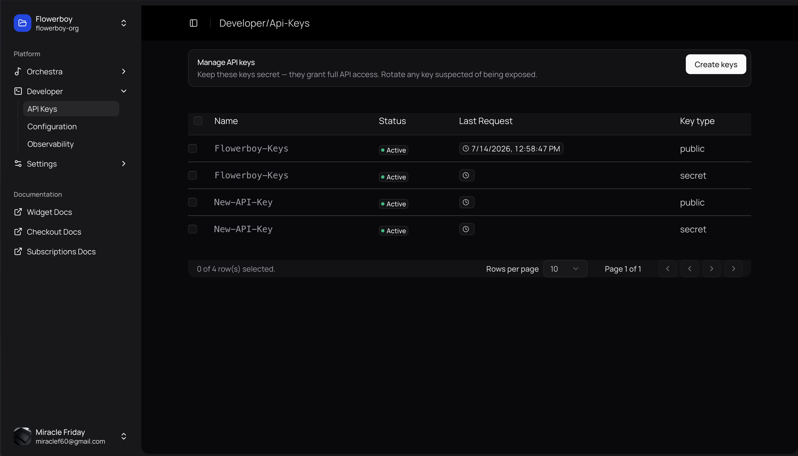

## Authentication methods
There are 2 modes of authentication which can usually be use interchangeably with each other:
1. `Baggit-Public-Key{:sh}`: Used mostly in requests that do not carry out the transfer or processing of value (any amount) from the merchants balance.
	### Route examples
	- Checkout `/v1/checkout{:sh}`
	- Widgets `https://widget.baggit.link?api_key=<Baggit-Public-Key>{:sh}`
	- Payout banks `/v1/payout/banks{:sh}` get list of banks for payout request
	- Name lookup [`/v1/payout/lookup{:sh}`](https://api.baggit.link/v1/reference#tag/payout/POST/v1/payout/lookup) get account name for a bank and account number

2. `Baggit-Secret-Key{:sh}`: Used where the highest level of authentication is required to carry out sensitive actions, like carrying out transfer or processing payout from the merchants balance.

	### Route examples
	- Payout `/v1/payout{:sh}`
	- Wallet `/v1/wallet{:sh}` carry out wallet related actions through API or SDK

## How to authenticate request
To authenticate a request to the Baggit Service API, make sure to add the one of the following headers: `Baggit-Pubic-Key{:sh}` or `Baggit-Secret-Key{:sh}`

### Get the keys
First get the keys from your [Baggit Merchant Dashboard](https://merchant.baggit.link) by following the steps below:

#### Create account [step]
Head over to the [Baggit Merchant Dashboard](https://merchant.baggit.link) to create your accuont on the authentication screen.


#### Create organization [step]
After sign-up go ahead and create an organization, name it whatever you want preferably your product or company name.


#### Create API Key [step]
Now you can create your API keys, navigate to the `API-Keys{:sh}` page under `Developer{:sh}` section. When creating API keys note that you need to name them something unique incase of exposure or suspicious activities with the keys you can quickly identify and delete or deactivate the key.

<Callout type="info">Make sure to copy your keys and store in a secure file such as a `.env{:sh}` file, once the API Key modal is closed the keys would not be shown again!</Callout>


### Use the keys
To use the API keys add it to the `Headers{:sh}` field of a request to any Baggit services API endpoints. DO NOT hardcode the keys, always use a hidden `.env{:sh}` file and reference the environment variable as supported in your projects programming language or framework.
<Callout type="warn">
	DO NOT hardcode API Keys as plaintext in your code, this could result in sever security breach and potential loss of funds.
</Callout>

```ts tab="Node.js"
````
```go tab="Golang"
````
```php tab="PHP"
````
```py tab="Python"
````
