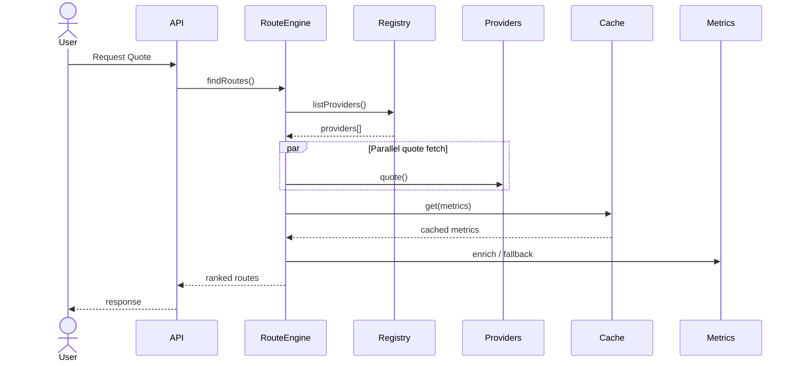
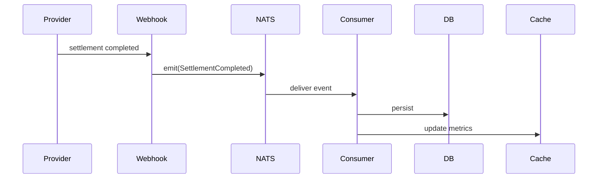

# REQUIREMENTS.md
# Engineering RFC — Adaptive Provider Routing Architecture (APRA)

## Status
Draft RFC

## Objective
Build a serverless-first, package-first TypeScript platform for crypto on/off-ramp aggregation across multiple providers, with adaptive routing based on:
- provider availability
- fee efficiency
- historical settlement speed
- liquidity depth
- reliability / success rate
- compliance compatibility

Core infrastructure:
- Runtime: Bun / TypeScript
- Messaging: NATS (Core + KV + JetStream)
- Dev DB: SQLite
- Prod DB: Turso (libSQL)
- Deployment: Serverless compute

---

# 1. System Architecture

## Architectural Style
Hexagonal Architecture + Strategy + Registry + Event Sourcing + CQRS-lite

## Layers
1. Domain
2. Application
3. Ports
4. Adapters
5. Infrastructure
6. SDK / External packages

Dependency rule:

Infrastructure -> Adapters -> Ports -> Application -> Domain

---

# 2. Sequence Diagrams

## 2.1 Quote Discovery



## 2.2 Settlement Analytics



---

# 3. Monorepo Layout

```text
packages/
  core/
  contracts/
  primitives/
  adapters/
    nats/
    sqlite/
    libsql/
  providers/
    moonpay/
    transak/
    ramp/
  sdk/

apps/
  api/
  webhook/
  workers/

infra/
  docker/
  terraform/
  github/
```

---

# 4. Package Interfaces

## @apra/core
Exports:
- RouteEngine
- ProviderRegistry
- RouteScorer
- SettlementAnalytics
- CircuitBreaker

## @apra/contracts
Exports:
- events
- DTOs
- provider interfaces
- domain entities

## @apra/primitives
Exports:
- emit()
- subscribe()
- cache()
- lock()
- idempotent()

## @apra/providers-*
Provider implementations

## @apra/sdk
Third-party embeddable SDK

---

# 5. TypeScript Contracts

## Provider Contract

```ts
export interface RampProvider {
  readonly name: string;
  readonly capabilities: ProviderCapabilities;

  isAvailable(region: string): Promise<boolean>;
  quote(req: QuoteRequest): Promise<ProviderQuote>;
  initiate(req: TransactionRequest): Promise<Transaction>;
  status(txId: string): Promise<SettlementStatus>;
}
```

## Event Primitive

```ts
export interface EventBus {
  emit<T>(subject: string, payload: T): Promise<void>;
  subscribe<T>(subject: string, handler: (payload: T) => Promise<void>): Promise<void>;
}
```

## Cache Primitive

```ts
export interface CachePort {
  get<T>(key: string): Promise<T | null>;
  set<T>(key: string, value: T, ttl?: number): Promise<void>;
  delete(key: string): Promise<void>;
}
```

## Repository Contract

```ts
export interface ProviderMetricsRepository {
  upsert(metrics: ProviderMetrics): Promise<void>;
  get(provider: string): Promise<ProviderMetrics | null>;
}
```

---

# 6. NATS Primitives

## emit()

```ts
await emit("SettlementCompleted", payload);
```

Features:
- JSON serialization
- trace propagation
- retry
- DLQ
- typed payload validation

## subscribe()

```ts
await subscribe("SettlementCompleted", handler);
```

Features:
- ack abstraction
- retry policy
- dedupe
- idempotency

## cache()
Uses NATS KV

## durable streams
Uses JetStream

Streams:
- settlement.events
- quote.events
- provider.health.events

---

# 7. Data Model

Tables:
- providers
- quotes
- transactions
- settlements
- provider_metrics
- route_metrics
- event_log

Indexes:
- provider + created_at
- tx_id unique
- settlement_duration
- region + asset pair

---

# 8. Deployment Topology

```text
Client
  |
Serverless API Edge
  |
Route Engine
  |---- NATS Core
  |---- NATS KV
  |---- NATS JetStream
  |
Turso (libSQL)
  |
Workers / Consumers
```

## Compute
- API routes: serverless
- webhooks: serverless
- analytics consumers: serverless scheduled / queue workers

## Persistence
- Turso primary
- edge replicas for reads

## Cache
- NATS KV

## Event log
- JetStream durable streams

---

# 9. CI/CD

## Pipeline
1. lint
2. typecheck
3. unit tests
4. contract tests
5. integration tests
6. build packages
7. publish canary
8. deploy staging
9. smoke tests
10. production deploy

## Required Gates
- 90%+ domain coverage
- no circular deps
- API compatibility checks
- provider contract validation
- security scan

## Release Strategy
Changesets + semantic versioning

---

# 10. Testing Strategy

## Unit
Mock all ports

## Contract
Every provider must pass provider contract suite

## Integration
Real:
- NATS
- SQLite
- libSQL adapter

## Load
Simulate 1000 concurrent route requests

## Chaos
Inject:
- provider timeout
- NATS latency
- partial DB outage

## Replay
JetStream replay to rebuild analytics

---

# 11. Acceptance Criteria

Adding a provider requires:
- implementing RampProvider
- registry registration
- zero core modifications

Cold starts < 300ms target
p95 route discovery < 500ms cached
p95 route discovery < 2s uncached
